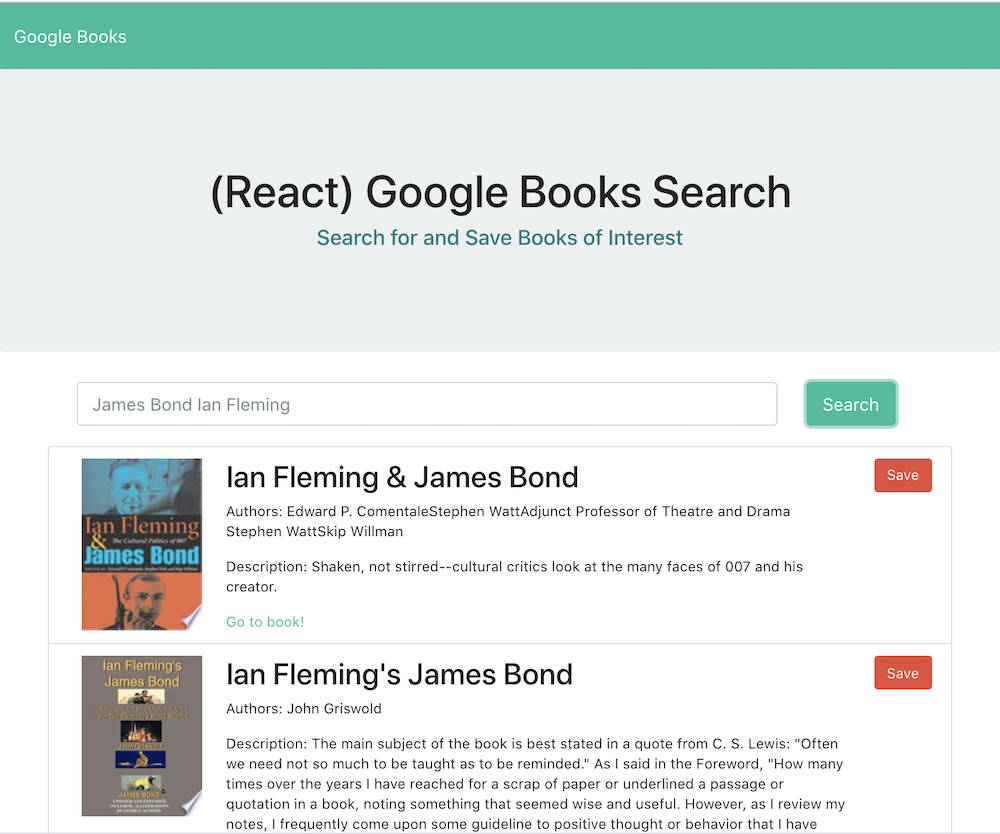

# google-books-search

## Table of Contents
#### &nbsp;&nbsp;&nbsp;&nbsp;[1)&nbsp;Introduction](#introduction)
#### &nbsp;&nbsp;&nbsp;&nbsp;[2)&nbsp;Instructions](#usage)
#### &nbsp;&nbsp;&nbsp;&nbsp;[3)&nbsp;Links](#links)
#### &nbsp;&nbsp;&nbsp;&nbsp;[4)&nbsp;Contributing](#contributing)
#### &nbsp;&nbsp;&nbsp;&nbsp;[5)&nbsp;License](#license)
#### &nbsp;&nbsp;&nbsp;&nbsp;[6)&nbsp;Questions](#questions)   

## Introduction 

Not surprisingly, our last homework assignment of this cohort was one of the most difficult if not the most difficult of them all.  We were assigned the task of creating a google book search app that pulls search results from the Google Books API.  Search listings were to populate beneath the search bar and users were to be able to click on a "save" button to save their books to a separate "save" component.  From there a user was to be able to delete books as needed.  Each book listing was to show title, authors, description, a link to the book, and a thumbnail book cover image.

## Usage

The deployed app does have some functionality in that it can query the Google Books API and return an array of results.  However, the query URL does not seem to pull all possible results and when searching for more specific results there is often nothing returned.  And, when no results are found, the app goes to a blank screen rather than displaying as intended with "No books to display".  On each row of results there is a "save" button but this button is not yet functional.  That button is intended to do a post route which is to populate a MongoDB called "googlebooks" and to render on the "saved" component.  From there a user would presumably be able to click a delete button if they no longer wanted to keep a book on their saved list.

## Links

The URL for this project is https://google-books-search-gt-ft.herokuapp.com/

The URL for this project's GitHub repository is: https://github.com/7J647/google-books-search

Screenshot:
 

 

## Contributing

With thanks to Head Coach Jonathan Watson for his class demo on this assignment along with TA Peter Colella and to Josh Furlin for his excellent tutoring. 

## License

MIT License

Copyright (c) 2020 Jeff Flynn

Permission is hereby granted, free of charge, to any person obtaining a copy
of this software and associated documentation files (the "Software"), to deal
in the Software without restriction, including without limitation the rights
to use, copy, modify, merge, publish, distribute, sublicense, and/or sell
copies of the Software, and to permit persons to whom the Software is
furnished to do so, subject to the following conditions:

The above copyright notice and this permission notice shall be included in all
copies or substantial portions of the Software.

THE SOFTWARE IS PROVIDED "AS IS", WITHOUT WARRANTY OF ANY KIND, EXPRESS OR
IMPLIED, INCLUDING BUT NOT LIMITED TO THE WARRANTIES OF MERCHANTABILITY,
FITNESS FOR A PARTICULAR PURPOSE AND NONINFRINGEMENT. IN NO EVENT SHALL THE
AUTHORS OR COPYRIGHT HOLDERS BE LIABLE FOR ANY CLAIM, DAMAGES OR OTHER
LIABILITY, WHETHER IN AN ACTION OF CONTRACT, TORT OR OTHERWISE, ARISING FROM,
OUT OF OR IN CONNECTION WITH THE SOFTWARE OR THE USE OR OTHER DEALINGS IN THE
SOFTWARE.

## Questions

Connect with me at Github: <a href="https://github.com/7J647">7J647</a> &nbsp;&nbsp;&nbsp;&nbsp;
Contact me via Email: [jeffreyedwardflynn@gmail.com](mailto:jeffreyedwardflynn@gmail.com)
